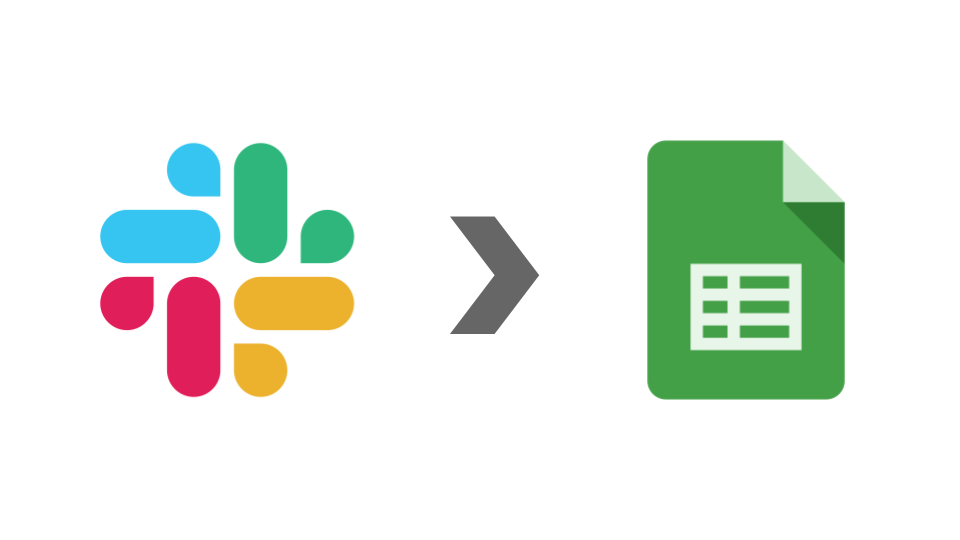

# slack_history

## 概要

slackの指定チャンネルでのメッセージを、google sheetsに保存します。

- 保存結果
  - 
- 結果通知
  - 

## インストール

### 1. slackでappを登録する

- [slack api / Your Apps](https://api.slack.com/apps) を開く
- Create New App をクリック
  - App Name: slack_history
  - Workspace: インストールするworkspaceを選択
- Basic Information を設定
  - Display Information
    - Description: Save slack messages to google sheets.
    - Icon: 任意
    - Color: #1d7c00
    - Save Changes をクリック
- OAuth & Permissions を設定
  - Scopes
    - Select Permission Scopes
      - channels:history
      - groups:history
      - im:history
      - users:read
      - chat:write:bot
    - Save Changes をクリック
  - Install App to Workspace をクリック
    - OAuth Access Token をコピー

### 2. google sheetsを設定する

- [google sheets をコピー](https://docs.google.com/spreadsheets/d/1D4eDeWP5IZqJ4192aKk1OzjaS4QdX2iyC06LLgJMzRM/copy)
- OAuth Access Token を設定
  - スクリプトエディタを開く
    - ツール / スクリプトエディタ
  - プロジェクトのプロパティを開く
    - ファイル / プロジェクトのプロパティ / スクリプトのプロパティタブ
  - +行を追加 をクリック
    - プロパティ: SlackBotToken
    - 値: コピーした OAuth Access Token
    - 
- 保存する slack channel を設定
  - settingsシート / slack.load.channel_id
  - チャンネルID
- 結果を通知する slack channel を設定
  - settingsシート / slack.report.channel
  - #チャンネル名

## 機能

### オンデマンド保存

開始日、終了日を指定して保存します。

- 実行方法
  - 開始日を指定
    - settingsシート / load.start_date
    - yyyy-mm-dd 形式
  - 期日を指定
    - settingsシート / load.end_date
    - yyyy-mm-dd 形式
  - メニューから起動
    - メニュー / 【slack_history】 / slack -> sheets
    - 

### バッチ保存

前回の終了日から、今回の処理前日分を保存します。
※設定値は「開始日 = 前回の終了日」、「終了日 = 処理当日」です。

- 設定方法
  - スクリプトエディタを開く
    - メニュー / スクリプトエディタ
  - トリガー設定を開く
    - メニュー / トリガーアイコン
  - 任意の繰り返し頻度で mainBatchLoad を設定
    - 
